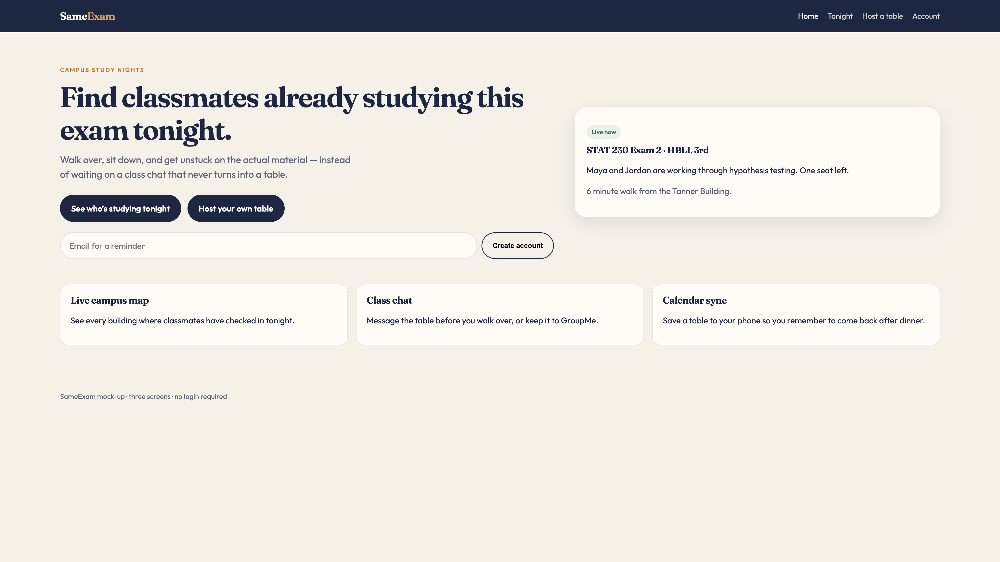
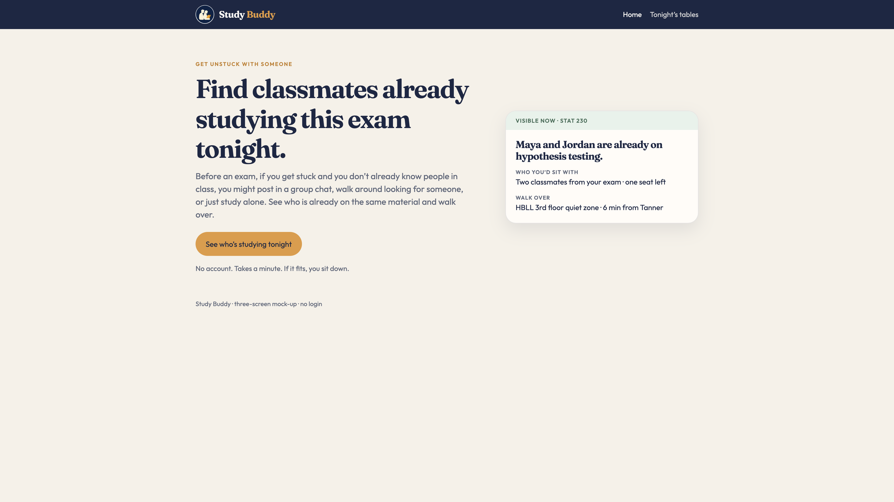

# Study Buddy

Live site: https://mjpalm13.github.io/same-exam/

GitHub repo: https://github.com/Mjpalm13/same-exam

First AI commit, before I changed anything: https://github.com/Mjpalm13/same-exam/commit/d0ee442

## Product description

Study Buddy is a three-screen mock-up for finding classmates who are already studying for the same exam nearby. Instead of creating a study group from scratch, you can see who is already studying, what they are working on, and where they are.

**Affordance sentence:** Find classmates already studying this exam tonight.

---

## 1. Need, persona, capability, and value

**Need**  
Many BYU students experience high-stress academic isolation right before exams because there is no real-time way to locate and verify classmates who are studying for the same exam at that exact moment.

**Persona 1: Last-Minute Leah**

| **Name** | Leah Morgan |
| --- | --- |
| **Demographics** | **Age:** 21 **Gender:** Female **Occupation:** College Student, majoring in Business |
| **Life Circumstances** | Leah is a junior who recently returned to BYU after serving a mission. She is living in an apartment near campus and is getting back into the routine of college life. Between classes, work, and other responsibilities, she does not always have a lot of time to study. She usually heads to the library with her laptop, notes, and class materials and tries to get as much done as possible before an exam. Since she has recently returned from her mission, she does not know many people in her classes very well yet. |
| **Personal Characteristics** | Leah usually studies alone, but she would rather have someone to work with when she gets stuck. She is comfortable reaching out to classmates, but she does not know many of them well enough to randomly message them about studying. She does not want to spend a lot of time trying to figure out who is available. When she gets stuck on a problem right before an exam, she wishes she could quickly see which classmates are studying for the same test and who is available and willing to work together. |
| **Goal** | Quickly find one or two classmates who are studying for the same exam right now so she can get unstuck, connect with classmates, and feel more prepared for the test. |

**Primary capability**  
Find classmates who are studying this subject on campus tonight.

The important part is that they can see who is already there instead of having to organize something from scratch.

**Fundamental value**  
Learning. The product does not teach the material itself. The value is getting unstuck on the material by connecting with classmates who are already studying the same thing. That matters because the student can spend their limited study time actually working through the material instead of trying to find someone.

---

## 2. The three screens

I only built three screens, and I picked the ones that show the idea working. I did not use a slot on login, settings, or creating a table, because those would not tell me if the main idea is clear.

**Landing**  
Job: Signal the primary capability and the value as fast as possible.  
Why it earned a slot: If this screen is confusing, nobody gets to the product.  
Design question: After five seconds, do they understand what Study Buddy does, or do they think it is another social or chat app?

**Tonight’s tables**  
Job: Show the capability happening. These are people studying right now for this exam.  
Why it earned a slot: This is the product working. A profile page would not tell me whether someone can actually see who is there and decide where to go.  
Design question: Can they quickly tell which table they would actually want to walk to?

**Table**  
Job: Show the value in action. They see a stuck point, they see real people, and they can decide to go sit down.  
Why it earned a slot: The list by itself is mostly browsing. This is where they decide this is what they need help with, and they can actually go there.  
Design question: Does seeing the people and what they are studying make “I’m walking over” feel like the obvious next step?

---

## 3. Design question plan

I am not collecting answers yet. These are worded how I would actually say them to someone in that persona. Next to each one is what I think they will say, and which part of the prototype that guess comes from.

**Need**  
“Okay, think about the last time you were on campus the night before a test, by yourself, and you kind of wanted someone from class there but didn’t really know who to ask. What did you end up doing?”

I think they will say they posted in GroupMe, walked around the library looking for a face they recognized, or just stayed alone. That prediction comes from the landing paragraph and from the STAT 230 card showing people who are already there.

**Value**  
“If that actually got solved for you on a night like that, what is one or two words for what you would get out of it? Why those words?”

I think they will say unstuck or learning, not easier. That is why the table screen leads with who is there and what they are working on, and why the kicker is “Get unstuck with someone.”

**Persona**  
“How often does this even come up for you? And what are you usually doing when it does, like where are you and how much time do you have?”

I think this comes up a few exam nights a semester, when they are already on campus with a laptop and a couple of hours. That is why the walk times are 3, 6, and 8 minutes, and why there is no account.

**Capability**  
“I’m going to show you this first screen for five seconds and then hide it. What does this thing do?”

I think they will say it shows who in their class is already studying tonight so they can go sit with them. That prediction is based on the headline, the one button (“See who’s studying tonight”), and the live STAT 230 example. If they say it is a social network, a chat app, or something you sign up for, the landing is still competing with itself.

**Capability**  
“Click around for a second. What would you tap first, and what do you think happens?”

I think they hit the orange button or the STAT 230 card and expect a list of tables they can actually walk to.

---

## 4. Design justification and first read

After I revised it, I opened the live site again like I had never seen it.

**Does the landing signal the capability and value at first glance, before reading?**  
Mostly, yes. The first thing I notice is “Get unstuck with someone,” then “Find classmates already studying this exam tonight.” That gives me both the reason to care and what I can do. The orange button is the one obvious next action.

The part I had to be careful with was the example table. It is useful because it makes the idea feel real, but it could also compete with the main message if it looks like another button or another feature. I kept it because it shows that people are actually there, instead of only telling the user they could find people.

**Does every element on the landing earn its place?**  
Most of it does now. The first version had too many things competing for attention. I had browsing, hosting a table, creating an account, and extra features like chat and a map. Those made the landing feel more like a description of a whole app than a focused test of the main idea.

I removed those because they did not help me answer the main question: would someone understand that they can find a classmate who is already studying the same exam?

**What belongs together, and which Gestalt principles communicate that?**  
Landing: I used figure-ground so the main message and button stand out from the lighter background. The example table is grouped as one common region because it is one real opportunity to study with someone. Inside that card, proximity keeps the people and the material together, since those are the two things you need to know before deciding whether to go.

Tonight’s tables: Each table is a common region. Inside each card, proximity groups the people with what they are studying, and the building with the walking time. Similarity keeps the three cards visually consistent, so they read as different options in the same product, not unrelated screens.

Table: The people and the study topic are grouped together because they answer “Is this someone I want to study with?” The location is in its own region because it answers the next question: “Can I actually get there?”

**Do screens 2 and 3 stay on mission, and can you get home?**  
Yes. Tonight is only live tables you could actually join. The table screen is only “is this my stuck point, and can I walk over and sit down?” Home, the logo, and the Study Buddy name go back to the landing from everywhere.

**What the AI initially got wrong, and what I changed**  
The AI’s first version was not bad visually, but it was trying to build too much. It treated the idea like a small social network instead of a focused way to find someone to study with. Browse, host, and sign up had similar visual weight, so there was no clear signaling of the primary capability.

The biggest change I made was reducing the landing screen to one main message, one main action, and one example of the capability working. I also changed the table screen from “Message the table” to “I’m walking over.” That mattered because messaging is basically the old workaround. The point of this prototype is to make the next step actually going to study with someone.

**Before and after**

The main change was reducing competing actions so the primary affordance became visually dominant. This was about signaling and grouping, not a color preference.

Before (first AI landing). Browse, host, and sign up all have similar visual weight, plus map / chat / calendar boxes:

After (revised landing). One value line, one affordance sentence, one button, and one example table:

First AI commit: https://github.com/Mjpalm13/same-exam/commit/d0ee442  
Revised landing: https://github.com/Mjpalm13/same-exam/blob/main/index.html
