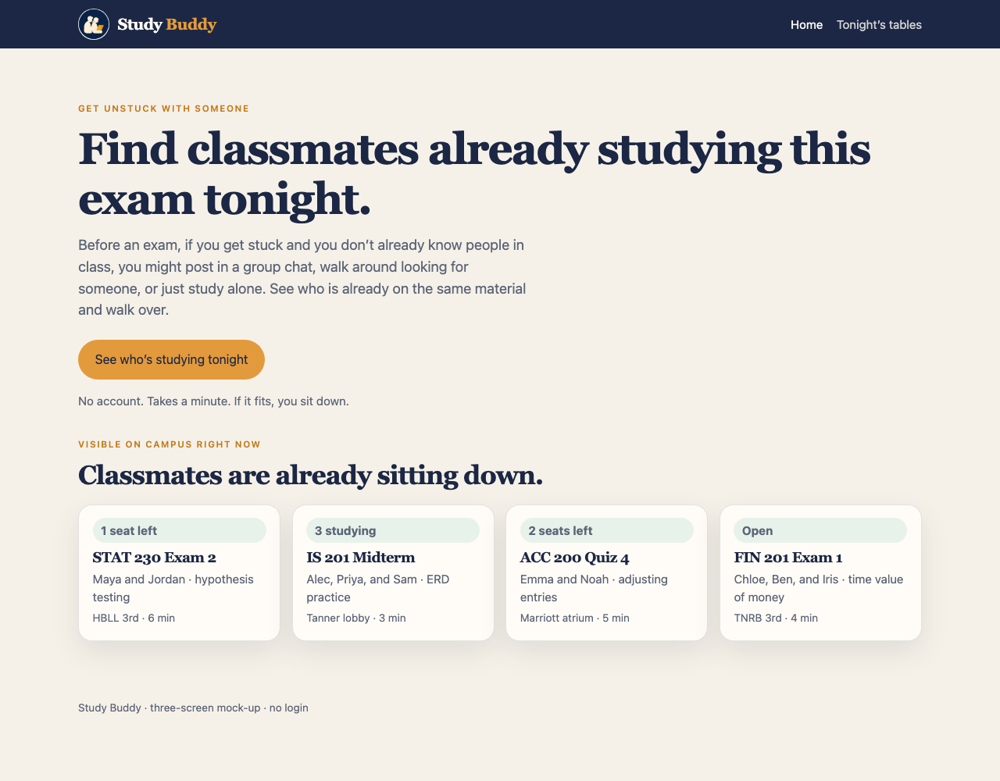
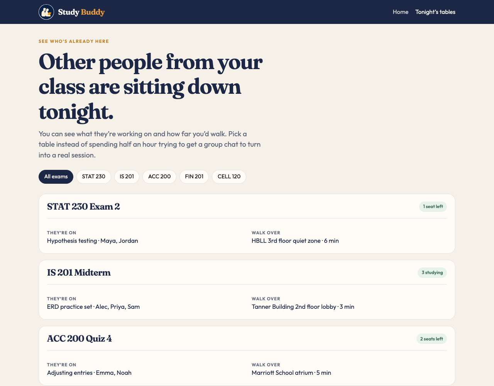
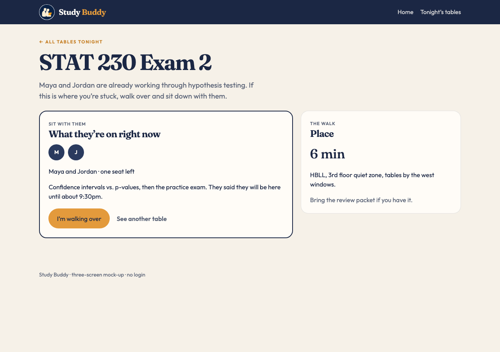

# Study Buddy

Live site: https://mjpalm13.github.io/same-exam/

GitHub repo: https://github.com/Mjpalm13/same-exam

First AI commit, before I changed anything: https://github.com/Mjpalm13/same-exam/commit/d0ee442

## Product description

Study Buddy is a three-screen mock-up for finding classmates who are already studying for the same exam nearby. Instead of creating a study group from scratch, you can see who is already studying, what they are working on, and where they are.

---

## 1. Need, Persona, Capability, and Value

**Need:**  
Many BYU students experience high-stress academic isolation right before exams because there is no real-time way to locate and verify classmates who are studying for the same exam at that exact moment.

**Persona (Last-Minute Leah):**

| **Name** | Leah Morgan |
| --- | --- |
| **Demographics** | **Age:** 21 **Gender:** Female **Occupation:** College Student, majoring in Business |
| **Life Circumstances** | Leah is a junior who recently returned to BYU after serving a mission. She is living in an apartment near campus and is getting back into the routine of college life. Between classes, work, and other responsibilities, she does not always have a lot of time to study. She usually heads to the library with her laptop, notes, and class materials and tries to get as much done as possible before an exam. Since she has recently returned from her mission, she does not know many people in her classes very well yet. |
| **Personal Characteristics** | Leah usually studies alone, but she would rather have someone to work with when she gets stuck. She is comfortable reaching out to classmates, but she does not know many of them well enough to randomly message them about studying. She does not want to spend a lot of time trying to figure out who is available. When she gets stuck on a problem right before an exam, she wishes she could quickly see which classmates are studying for the same test and who is available and willing to work together. |
| **Goal** | Quickly find one or two classmates who are studying for the same exam right now so she can get unstuck, connect with classmates, and feel more prepared for the test. |

**Primary capability**  
See which classmates are currently studying for the same exam and are available to connect.

The important part is that Leah can quickly see who is already studying instead of having to know people in her class or organize a study group from scratch. She can find someone who is already there, connect when she gets stuck, and get back to studying.

**Fundamental value**  
Connection. The product helps students feel less alone when they are struggling with an exam by making it easier to connect with classmates who are in the same situation. For Leah, this is especially valuable because she is new back to campus and does not know many people in her classes yet. Instead of spending her limited study time trying to find someone to study with, she can quickly connect with a classmate and focus on learning.

---

## 2. The Three Screens

I only built three screens because I wanted to focus on the main thing I am testing with Study Buddy. I did not want to use one of my three screens for things like logging in, settings, or creating an account because those parts do not really tell me whether the main idea works.

**Screen 1: Landing**
Page: https://mjpalm13.github.io/same-exam/ (`index.html`)
Job: Explain what Study Buddy does and give the user one obvious thing to do.
Why it earned a slot: This is the first thing someone sees, so they should understand the idea quickly.
Design question: After looking at this screen for five seconds, would someone understand that Study Buddy helps them find classmates who are already studying tonight, or would they think it is just another social or chat app?

**Screen 2: Tonight’s tables**
Page: https://mjpalm13.github.io/same-exam/tonight.html
Job: Show the main idea actually working. The user can see people who are already studying for the same exam and where they are.
Why it earned a slot: This is the part that makes Study Buddy different from just messaging people in a GroupMe. The student can see who is already studying instead of having to organize something themselves.
Design question: Can someone look at the different tables and quickly figure out which one they would actually want to walk to?

**Screen 3: Table**
Page: https://mjpalm13.github.io/same-exam/table.html?id=stat230
Job: Show what happens after someone finds a table. They can see who is there, what they are working on, and decide whether they want to join them.
Why it earned a slot: I wanted to show the actual moment where the student goes from “I am stuck” to “I found people who are working on the same thing.”
Design question: Does seeing the people and what they are studying make going over to the table feel like the natural next step?

---

## 3. Design Question Plan

I am not collecting answers yet. These are the questions I would ask someone who fits Leah's situation. I want the questions to help me figure out whether the problem is real to them and whether the prototype makes sense without me having to explain it first.

**Need**
“Think about the last time you were on campus the night before a test, studying by yourself, and wished you had someone from your class there. What did you end up doing?”

I want to see what students actually do when this happens. My guess is that they might message a GroupMe, text someone they already know, walk around the library hoping to recognize someone, or just keep studying by themselves. If that is what they normally do, it would help show whether there is actually a gap that Study Buddy could fill.

**Value**
“If Study Buddy actually worked for you on a night like that, what would you get out of it?”

I expect answers like “connection,” “help,” or “getting unstuck.” I do not think the main value is that studying becomes easier. The point is that students can find someone who is already in the same situation instead of feeling like they have to figure everything out by themselves.

**Persona**
“How often does this situation actually happen to you? Where are you usually studying when it does, and how much time do you normally have before the test?”

I want to know if Leah's situation is something students actually experience. My assumption is that this would happen a few times during a semester, usually when they are already on campus with their laptop and have a couple of hours to study. This is also why I made the example locations close enough that someone could realistically walk there.

**Capability**
“I am going to show you this first screen for five seconds, and then I will hide it. What would you say this thing does?”

This is probably one of the most important questions I would ask. I want to know if someone understands the main idea without me explaining it. Ideally, they would say something like, “It shows me who in my class is already studying tonight so I can go study with them.” If they think it is a social network, chat app, or something they have to sign up for, then I know the landing page still needs work.

**Capability**
“Click around for a second. What would you tap first, and what do you think will happen?”

I want to see what people naturally do instead of telling them where to go. I expect them to click the orange button or the STAT 230 example and look for a list of classmates and tables they can actually go to.

---

## 4. Design Justification and First Read

After I made my changes, I opened the live site again and looked at it like I had never seen it before. I wanted to see if the main idea was still obvious without thinking about what I had built behind the scenes.

**Does the landing make the main idea clear right away?**

Mostly, yes. The first thing I notice is “Get unstuck with someone,” followed by “Find classmates already studying this exam tonight.” I think those two lines work together because one explains why I would care and the other explains what Study Buddy actually does. The orange button also gives me one obvious next step.

I did have to be careful with the example table on the landing page. I wanted to show that this is something real that a student could use, but I did not want it to look like another main feature. I kept it because I think seeing an actual table with students studying makes the idea easier to understand than just telling someone they can find classmates.

**Does every element on the landing page have a reason to be there?**

I think most of it does now. The first version had a lot more going on. There were options for browsing, hosting a table, creating an account, chat, a map, and other features. Those things could be useful in a real product, but they were taking attention away from the one thing I actually wanted to test.

I removed those features because I wanted the landing page to answer one question: “Can I find a classmate who is already studying for the same exam?”

**What belongs together on each screen?**

On the landing page, I wanted the main message and button to feel like one group so it is obvious what Study Buddy is and what I should do next. I also grouped the example table together because it represents one actual opportunity to study with someone.

On the Tonight's Tables screen, each table is its own group. The students are grouped with what they are studying because I want the user to know both who is there and what they are working on. The building and walking time are grouped together because those answer a different question: “Where are they, and can I realistically get there?”

On the Table screen, the people and the study topic are grouped together because those are the things Leah needs to decide if this is the right group for her. The location is separated because it answers the next question: “Where do I go?”

**Do screens 2 and 3 stay focused on the main idea?**

Yes. The Tonight's Tables screen is focused on finding people who are already studying. The Table screen is focused on deciding whether that is someone I want to join. I did not want either screen to turn into a full social or messaging app.

I also made sure there is an easy way to get back home. The Study Buddy name and logo take the user back to the landing page from the other screens.

**What the AI initially got wrong, and what I changed**

The first version the AI created was not bad visually, but it was trying to make Study Buddy into too much of an app. It had browsing, hosting, signing up, chat, a map, and other features. The problem was that all of those things made it harder to see what the main idea actually was.

The biggest change I made was simplifying the landing page. Instead of trying to explain everything Study Buddy could eventually do, I focused it on one message, one button, and one example of the idea working.

I also changed the main action on the table screen from “Message the table” to “I’m walking over.” I made this change because messaging is basically what students can already do through GroupMe or text. The point of Study Buddy is to make it easier to actually find someone who is already studying nearby and go study with them.

**Before and after**

The biggest difference between the first AI version and my revised version is that I removed things that were competing with the main idea. I wanted the main action to stand out without needing a lot of explanation.

Before, the landing page had Browse, Host, Sign Up, and extra features like chat and a map:

After, I reduced it to the main value, what Study Buddy does, one button, and an example of someone already studying:

First AI commit: https://github.com/Mjpalm13/same-exam/commit/d0ee442
Revised landing: https://github.com/Mjpalm13/same-exam/blob/main/index.html
